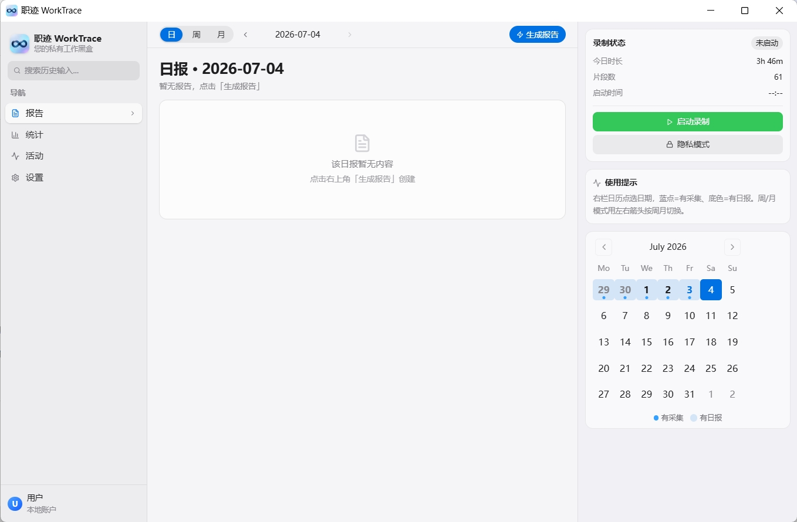
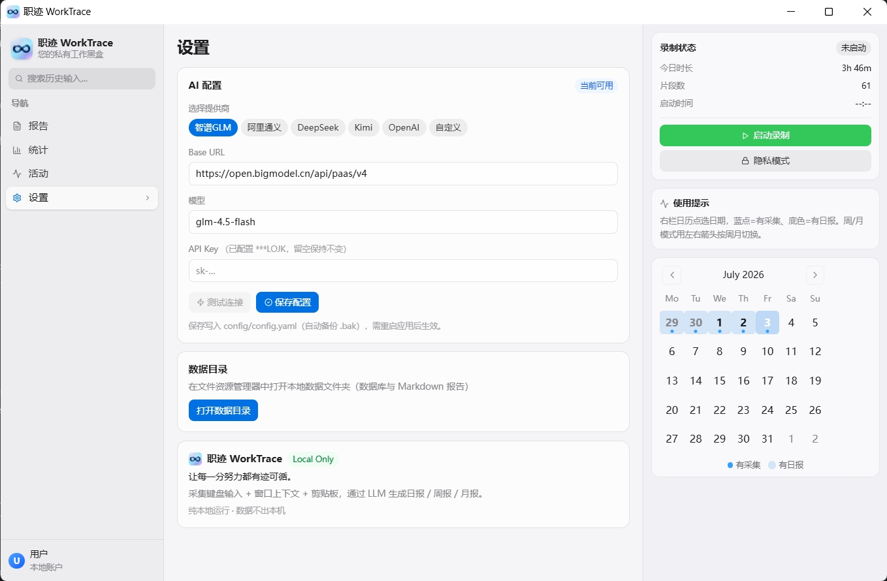

# 职迹 WorkTrace

> 让每一分努力都有迹可循 · 您的私有工作黑盒
> 隐私优先的个人 AI 工作日志 · 本地存储 · 开源可审计

轻量化个人工作日志采集与 AI 报告工具。采集输入活动 + 窗口上下文 + 剪贴板，通过 LLM 自动生成日报 / 周报 / 月报。

**纯本地运行（Local Only）· 不联网、不上传、数据只存本机。**

---

## 特性

- **三层采集**：输入活动 + 窗口切换 + 剪贴板
- **AI 报告**：日报 / 周报 / 月报，支持任意 OpenAI 兼容模型（智谱 GLM、阿里通义、DeepSeek、Kimi、OpenAI、自定义）
- **Web GUI**：macOS 风格三栏界面（pywebview + React），Windows 原生窗口
- **五视图导航**：报告 / 统计 / 活动明细 / 设置 / 关于
- **常驻日历**：标记有采集（蓝点）与有日报（底色）的日期，周 / 月切换
- **全文搜索**：检索历史输入记录，按日期 / 应用定位
- **应用分类**：10 类自动分类（开发/浏览器/通讯/办公/设计/娱乐/系统/数据库/AI），含分类统计
- **专注模式**：娱乐应用检测提醒 + 专注会话 + 每日效率目标
- **数据导出**：活动数据 CSV / JSON 导出 + 待办列表 CSV 导出（UTF-8 BOM，Excel 兼容）
- **报告导出**：日报/周报/月报一键导出为 macOS 风格单文件 HTML（内联 CSS/SVG，可离线、可微信/邮件直发），浏览器 Ctrl+P 直接转 PDF
- **时间分布可视化**：LLM 从报告提取时间分布，纯 SVG 环形图渲染，导出 HTML 与 app 内统一呈现
- **REST API**：本地 HTTP 接口（127.0.0.1:19527），供第三方工具集成
- **键盘捕获引擎**：ctypes 直接调用 Windows API（WH_KEYBOARD_LL），专用线程 + 独立消息泵，不依赖第三方库，支持 PyInstaller 打包环境
- **IME 中文捕获**：智能识别中文输入法组合文本，记录汉字而非拼音
- **隐私保护**：首次启动告知弹窗 + 三层过滤 + 一键隐私模式 + 可选数据库加密（SQLCipher）
- **国产模型友好**：设置页下拉预设，填 Key 即用

## 界面预览

**主界面** — 报告 / 统计 / 活动 / 设置 四视图，右栏常驻日历（蓝点 = 有采集、底色 = 有日报）



**设置** — API 配置表单（任意 OpenAI 兼容模型，填 Key 即用）+ 数据目录 + Local Only



## 快速开始

### 方式一：下载打包版（推荐）

从 [GitHub Releases](https://github.com/xwmy13141314/Personal-Work-Blackbox/releases/latest) 下载 `WorkTrace.exe`，双击运行（无需 Python 环境，Windows x64）。

### 方式二：源码运行

```bash
pip install -r requirements.txt
python -m src.main            # Web GUI（默认）
python -m src.main --gui-tk   # tkinter 旧 GUI（回退）
python -m src.main --no-tray  # 命令行模式
```

或双击 `启动.bat`（自动检查依赖并启动）。

### 配置 API Key（推荐环境变量）

为避免密钥明文落盘，推荐通过**环境变量**提供 AI 提供商的 API Key（环境变量优先级高于 `config.yaml`，加载时自动覆盖）。命名规则为 `{PROVIDER}_API_KEY`（大写），例如 `GLM_API_KEY`、`DEEPSEEK_API_KEY`、`OPENAI_API_KEY`、`OLLAMA_API_KEY`。

Windows 持久化设置（PowerShell，重启后仍生效）：

```powershell
[Environment]::SetEnvironmentVariable("GLM_API_KEY", "你的真实密钥", "User")
```

也可以在「设置」页 GUI 表单中填写 API Key 后点「保存」（写入 `config.yaml`，重启生效）。

> `config/config.yaml` 中的 `api_key` 字段默认为占位符 `"your-api-key-here"`，未配置环境变量且未在 GUI 填写时 AI 报告功能不可用。

## 界面（三栏）

| 栏 | 内容 |
|----|------|
| 左栏 | 导航（报告 / 统计 / 活动 / 设置）+ 搜索框 + Logo |
| 中栏 | 当前视图内容 |
| 右栏 | 录制控制（启动 / 暂停 / 停止 / 隐私）+ 状态 + 日历 |

### 报告视图
日 / 周 / 月报切换，日期导航，点「生成报告」由 LLM 生成（Markdown 渲染）。录制中生成日报会自动包含当前会话内容。

### 统计视图
应用使用时长排行（今日 / 本周 / 本月），条形图 + 总活跃时长。

### 活动明细
按日期浏览会话列表（各应用 + 时长），点开看输入文本片段；左栏搜索框输入关键词，跨日期全文检索历史输入。

### 设置视图
- **AI 配置表单**：选提供商预设 → 填 API Key → 测试连接 → 保存（写入 config.yaml，重启生效）
- 数据目录（打开本地数据文件夹）
- 关于

## 配置

`config/config.yaml`（也可在「设置」页 GUI 编辑，保存后重启生效）。API Key 推荐通过环境变量提供，下例中的 `api_key` 仅为占位符。

```yaml
ai:
  default_provider: glm
  # api_key 为占位符；真实密钥请用环境变量 GLM_API_KEY 覆盖，避免明文落盘
  glm:
    api_key: "your-api-key-here"
    model: "glm-4.5-flash"
    base_url: "https://open.bigmodel.cn/api/paas/v4"

privacy:
  app_blacklist: [1password.exe, keepass.exe, ...]   # 这些应用不记录
  privacy_mode_duration: 30                            # 隐私模式时长（分钟）

collection:
  keyboard_enabled: true
  clipboard_enabled: true
  idle_threshold: 300                                  # 空闲阈值（秒）
```

支持的 AI 提供商均为 OpenAI 兼容协议，新增厂商只需在 `PROVIDER_PRESETS`（前端）加一条 + config 加字段。

### 应用分类

自动将应用会话归类到 10 个预设分类，支持自定义正则规则扩展。

### 专注模式

娱乐应用使用超 5 分钟自动提醒，可设定每日工作目标（默认 8 小时）。

### REST API（可选）

在 `config.yaml` 中启用本地 HTTP API：

```yaml
rest_api:
  enabled: false        # 默认关闭
  port: 19527           # 默认端口
  host: 127.0.0.1       # 仅本地访问
```

启用后访问 `http://127.0.0.1:19527/api/status` 获取数据。

## 隐私保护

四层架构：

1. **首次启动告知**（首次）：隐私告知弹窗，说明采集内容与数据存储方式，用户同意后开始采集
2. **应用黑名单**（自动）：密码管理器等窗口前台时完全不记录
3. **内容脱敏**（自动）：身份证 / 银行卡 / 手机号 / 邮箱 / JWT / API Key / IPv4 → `[FILTERED_*]`
4. **隐私模式**（手动）：右栏按钮一键开关，开启期间全部停录（30 分钟自动恢复或随时点关）

### 数据库加密（可选）

启用 SQLCipher 加密，数据文件无法被第三方工具直接读取：

```bash
pip install sqlcipher3-binary
# 在 config.yaml 中设置：
# storage:
#   encryption_enabled: true
# 设置环境变量：
set WORKTRACE_DB_KEY=你的加密密钥
```

所有数据仅存本机 `data/blackbox.db`，不联网上传。

## 数据

- `data/blackbox.db` — SQLite 主库（sessions / text_segments / clipboard_records / window_events / daily_reports / period_reports）
- `data/logs/` — 每日 Markdown 导出 + AI 报告
- `data/backup_历史库_*/` — 历史库归档（永不删）

## 打包

```bash
# 1. 构建前端
cd 界面优化/优化图设计为macOS风格
npm install
npm run build:desktop      # 输出到项目根 web_frontend/

# 2. 打包 exe
cd ../..
pyinstaller --noconfirm blackbox.spec
# 产物：dist/WorkTrace.exe（含 ∞ 图标）
```

重新打包需先关闭运行中的 `WorkTrace.exe`（Windows 文件锁）。

## 项目结构

```text
src/
├── main.py              # 主入口 / BlackboxEngine
├── collector/           # 输入 / 窗口 / 剪贴板 / 空闲采集
│   └── keyboard_hook.py # 键盘捕获引擎（ctypes WH_KEYBOARD_LL + 专用线程消息泵）
├── processor/           # 输入缓冲 / 隐私过滤 / 会话管理
│   ├── input_buffer.py  # 含 IME 文本处理 + 智能去重
│   ├── privacy_filter.py
│   ├── session_manager.py
│   ├── app_classifier.py # 应用自动分类（10 类）
│   └── focus_mode.py    # 专注模式管理器
├── storage/             # SQLite + Markdown 导出
│   ├── database.py      # 含 SQLCipher 加密支持
│   ├── models.py
│   └── data_exporter.py # CSV/JSON 数据导出
├── ai/                  # LLM 客户端 / 提示词 / 报告生成
├── ui/                  # web_ui / web_api / rest_api
│   ├── web_ui.py        # pywebview 窗口 + 自动启动采集
│   ├── web_api.py       # JS 桥接 API
│   ├── rest_api.py      # 本地 REST API 服务器
│   └── notification.py  # 系统通知
└── config/              # 配置管理
界面优化/优化图设计为macOS风格/   # React 前端源码
├── src/app/components/  # Sidebar / StatsView / ActivityView / SettingsView / AboutView / PrivacyConsent
├── src/app/lib/utils.tsx # 共享工具与组件
├── src/styles/theme.css  # CSS 变量主题
web_frontend/                    # 前端构建产物（打包输入）
config/                          # 配置文件
data/                            # 数据 + 日志 + 归档
.github/workflows/               # CI 流水线
```

## Personal Recorder 模块（可选）

仓库另含 `src/personal_recorder` 事件化记录器（v3.0 引入），支持统一事件模型、inbox 接入、Git / Shell / 浏览器历史快照、macOS 采集、`.ics` 导出等。与 Web GUI 并行，互不依赖。

```bash
PYTHONPATH=src python3 -m personal_recorder init-db
PYTHONPATH=src python3 -m personal_recorder build-day --date 2026-07-03
```

详情见 `CHANGELOG.md` 的 v3.0 条目。

## 更新日志

详见 `CHANGELOG.md`。

### v4.2.0 (2026-08-08) — 报告可视化 + 导出能力

- **报告导出**：日报/周报/月报导出为 macOS 风格单文件 HTML（卡片化 + 时间分布环形图，内联 CSS/SVG 无外部依赖）；内置 `@media print`，浏览器 Ctrl+P 直接转 PDF
- **待办导出**：待办列表导出 CSV（UTF-8 BOM，Excel 中文不乱码），状态/优先级中文映射
- **时间分布环形图**：LLM 从报告提取分类占比（复用 todo_extractor 模式）+ 纯 SVG 渲染，导出 HTML 与 app 内共用一处生成
- 新增 `src/storage/report_exporter.py`、`src/ai/timedist_extractor.py`；测试基线 292 passed

**打包与发布（2026-08-08）：**
- **windowed exe**：`console=False` + 子进程 `CREATE_NO_WINDOW`，双击运行不再弹出终端黑窗；Toast 通知不再闪窗
- **关于页修正**：联系邮箱更正为 `xwmy1314@gmail.com`；前后端版本号统一为 4.2.0（前端 `APP_VERSION` / 后端 `/ping` 返回值）
- **.gitignore 加固**：补充 `.env` / `.env.*` 规则，防止密钥文件误上传
- 已发布至 [GitHub Release v4.2.0](https://github.com/xwmy13141314/Personal-Work-Blackbox/releases/tag/v4.2.0)（含 `WorkTrace.exe`）

### v4.1.0 (2026-07-08) — 键盘捕获引擎重构 + 关于页面

#### 键盘捕获引擎彻底重构
- 抛弃 pynput.Listener，改用 ctypes 直接调用 Windows API（WH_KEYBOARD_LL）
- 专用线程 + 独立消息泵（GetMessageW 循环），不依赖 pywebview 主线程
- 64 位类型修复：LRESULT/WPARAM/LPARAM 使用 c_ssize_t/c_size_t
- 虚拟键码→字符：硬编码映射 + MapVirtualKeyW，不依赖 GetKeyboardState
- IME 中文捕获：WH_GETMESSAGE 钩子 + 主动轮询 ImmGetCompositionStringW
- 钩子生命周期：stop() 不卸载钩子，仅设暂停标志；shutdown() 才卸载
- 全链路诊断日志：首次按键/字符转换/文本提交/会话持久化

#### 新增「关于」页面
- 五视图导航：报告 / 统计 / 活动 / 设置 / 关于
- 版本信息 + 隐私承诺 + 联系方式（邮箱 + GitHub）

#### 其他改进
- 自动启动采集（3秒延迟，pywebview 窗口加载后）
- 竞态条件修复：_on_closing 与 _auto_start 线程协调
- markdown_exporter zlib.error 修复
- 测试适配：244 passed

### v4.0.0 (2026-07-06) — 品牌重定位 + 发布红线 + 功能增强

#### 第一期：发布前红线
- 品牌重定位：去除旧措辞，改为"活动追踪"
- 首次启动隐私告知弹窗
- 数据库加密支持（SQLCipher）
- IME 中文输入法组合文本捕获
- 前端组件拆分 + CSS 变量统一
- 依赖清理（46→11 个前端依赖）
- 核心引擎集成测试（16 个新测试）

#### 第二期：功能增强
- 自动应用分类系统（10 类预设规则）
- 数据导出（CSV/JSON）+ 本地 REST API
- 专注模式与提醒系统
- CI 测试流水线（GitHub Actions）
- personal_recorder 模块隔离
- 打包体积优化

### v3.2.0 (2026-07-06) — 安全加固与线程安全

#### 安全
- API Key 支持环境变量加载（GLM_API_KEY / DEEPSEEK_API_KEY 等），避免明文存储
- 清理 config.yaml 中的明文密钥，改用占位符
- 隐私过滤正则大幅补全：新增 JWT Token、API Key (sk-xxx)、IPv4 地址、PEM 私钥、URL 内嵌凭据
- 银行卡正则支持 16-19 位
- NUMBER_PATTERN 阈值从 6 位提高到 8 位，减少误杀
- 自定义正则编译容错（单条非法不影响其余）

#### 线程安全（P0 修复）
- Database：所有读写操作加 threading.Lock 保护，消除多线程 commit/rollback 互相干扰
- InputBuffer：所有缓冲区操作加锁，消除键盘线程与窗口线程的竞态
- SessionManager：所有会话操作加锁，消除 TOCTOU 错误
- 新增 insert_session_with_segments 原子性批量插入方法，解决会话持久化非原子问题
- 会话持久化改为单事务写入

#### 功能修复
- 实现 Ctrl+A 全选替换功能（之前文档宣称但未实现）
- 剪贴板回调增加黑名单检查（之前密码管理器中复制密码仍被记录）
- 修复 KeyboardHook char 解析运算符优先级隐患
- SessionManager 新增 MAX_SEGMENTS_PER_SESSION 限制，防止超长会话内存无限增长

#### UI/错误处理
- 后端控制方法（start/stop/pause/resume/toggle_privacy）统一加 try/except
- _tasks 字典读取后自动清理，防止内存单调增长
- web_ui.py os._exit 前加 0.5s 延迟确保 DB flush 完成
- AI 层降级链支持自定义提供商（不再仅限 FALLBACK_ORDER 硬编码列表）
- 版本号统一为 3.2.0（pyproject.toml 与 CHANGELOG 一致）
- 构建产物 title 修正为「职迹 WorkTrace」

### v3.1.0 (2026-07-03) — 职迹 WorkTrace：Web GUI + 品牌化 + 多模型

- 全新 Web GUI（pywebview + React）替代 tkinter，macOS 风格三栏
- 四视图导航（报告 / 统计 / 活动明细 / 设置）+ 全文搜索
- 常驻日历（圆角，撑满，双标记有采集 / 有日报，周月跳转）
- 设置页 API 配置可编辑表单 + 通用 OpenAI 兼容 Provider（智谱 / 阿里 / Kimi / DeepSeek / OpenAI / 自定义）+ 测试连接
- 隐私模式改真·开关（可随时关）
- 录制中生成日报 flush 修复
- 品牌化：改名「职迹 WorkTrace」，∞ 莫比乌斯环图标（圆角），Slogan，Local Only 标注
- 数据：5 库分叉合并为单一权威主库，历史库归档，清理冗余 188M

### v3.0 (2026-06-07) — Personal Recorder 升级模块

见 `CHANGELOG.md`。

### v2.3 (2026-05-27) — 周报 / 月报 + 目录整理 + 安全加固

- 周报与月报功能
- 目录整理与数据库合并
- 打包与安全加固
